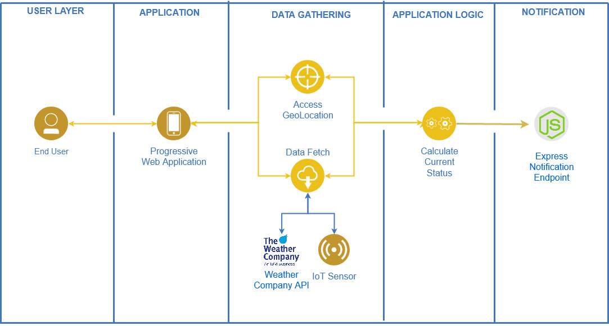
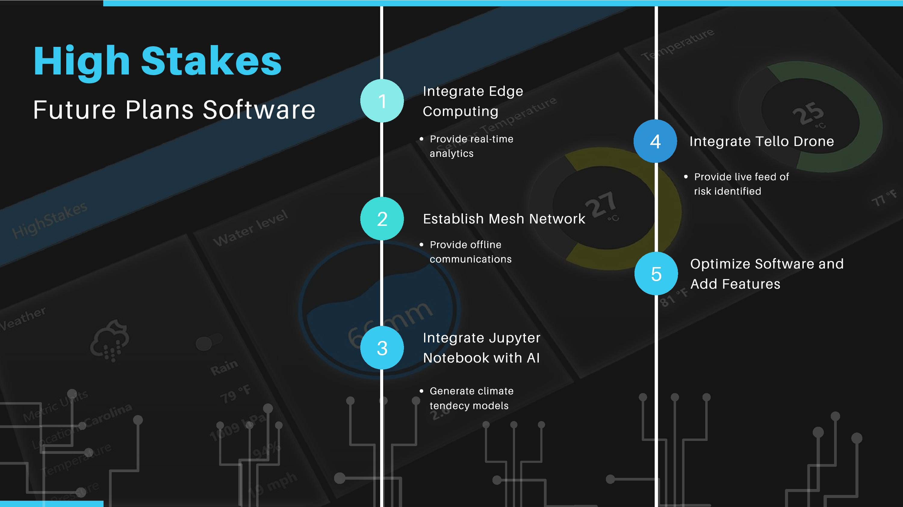
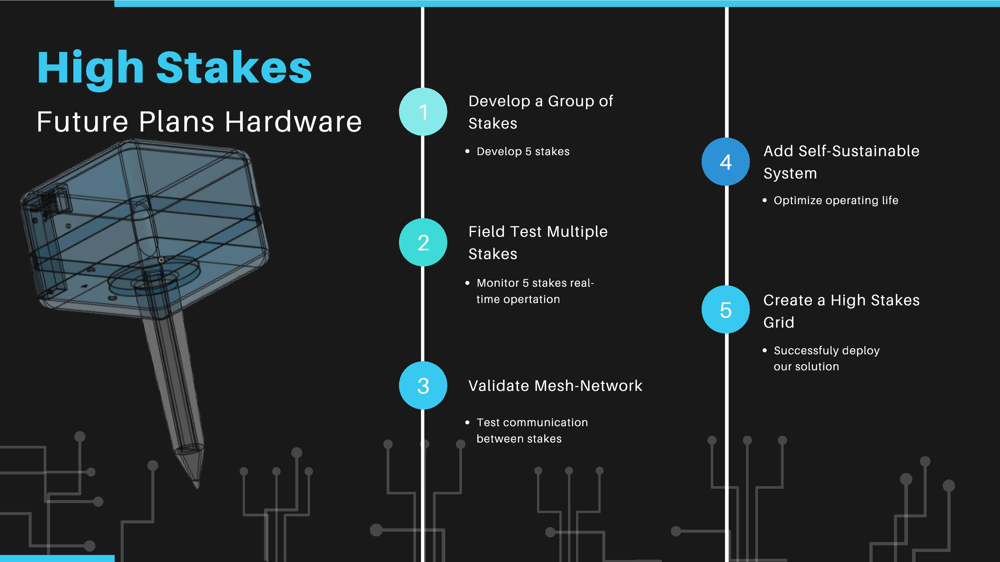

# High Stakes

## What is High Stakes?
Our project was started by 5 college students from Puerto Rico who saw too many naural disasters take away the crops in the farmlands and damage many properties in our cities. After many years of seeing our communities suffer, we decided to accept the challenge in developing an easily deployable solution that helps people get warnings before the situation reaches a point of no return. Our solution comes by integrating dynamic IoT sensors with a web application that alerts each member of the community in a way they can be aware of what is happening realtime. 

## Contents

1. [Short description](#short-description)
1. [Demo video](#demo-video)
1. [The architecture](#the-architecture)
1. [Long description](#long-description)
1. [Project roadmap](#project-roadmap)
1. [Getting started](#getting-started)
1. [Running the tests](#running-the-tests)
1. [Live demo](#live-demo)
1. [Built with](#built-with)
1. [Contributing](#contributing)
1. [Versioning](#versioning)
1. [Authors](#authors)
1. [License](#license)
1. [Acknowledgments](#acknowledgments)

## Short description

### What's the problem?
In recent years, climate change has affected negatively our environment, resulting in global warming and recurrent weather related catastrophes.

### How can technology help?

By using IoT sensors, IBM Cloud services and open source code, a web application was developed to monitor environmental data measured by an IoT sensing stake. This measures hyper-localized conditions which can be monitored and compared to the Weather Company API. This comparison triggers alerts when anomalies are found to let the user know of any danger.

### The idea
Our goal is to build a 'high stakes' grid to alert users of potential dangers associated to climate change while monitoring different tendencies using AI software.
With this we’ll be able to monitor hyper-local environmental conditions such as air humidity and temperature, water level and soil humidity. 

## Demo video


## The architecture



## Long description

More detail is available [here](DESCRIPTION.md)

## Project roadmap





## More business detail available [here:](business.md)


## Getting Started
This project was bootstrapped with [Create React App](https://github.com/facebook/create-react-app).

Note: The following instructions cover the necessary steps to run the FrontEnd application which is capable of fetching the simulated IoT data as well as fetch the current weather from your location (given permission). This values are then compared and based on a given threshold, will result in a status shown of either (STABLE, WARNING, or ALERT). To enable Push Notifications, the repo found here: [BackEnd](https://github.com/High-Stakes-UPRM/HighStakesBackend) has to also be setup. This other repo contains the BackEnd code developed using Node with the Express framework.


### Prerequisites

You need to have installed: \
 HighStakes Repository\
 [Node.js](https://nodejs.org/en/)

### Installing

Load your terminal and navigate to the folder containing the High
Stakes  directory, we used CMD but the process is the same in Linux console.\

```
C:\Users\User> cd (drag HighStakes from FileExplorer)
C:\Users\User\Documents\GitHub\HighStakes>
```


Once inside the project directory, we must install all necessary dependencies by running:

### `npm install`
```
C:\Users\User\Documents\GitHub\HighStakes>npm install
```


After the installs complete, we can start the application by running:

### `npm start`

```
C:\Users\User\Documents\GitHub\HighStakes>npm  start
```

Which runs the app in the development mode.<br />
Open [http://localhost:3000](http://localhost:3000) to view it in the browser if it doesn't open automatically. 

The page will reload if you make edits.<br />


## Running the tests


### Break down into end to end tests


### And coding style tests


## Live demo

You can find a running system to test at [http://hsnr.mybluemix.net/](http://hsnr.mybluemix.net/)


## Built with

[Node-RED](https://nodered.org/)\
[Watson IOT platform]\
[IBM Cloudant]\
[IBM]\
[Weather company API]\

## Manufacturing 

- [Soil Moisture Sensor Module YL-69 and HC-38 Module](https://www.amazon.com/ARCELI-Hygrometer-Moisture-Detection-Arduino/dp/B07CQT5RC8/ref=sr_1_7?crid=27WAVVS4OHNI9&dchild=1&keywords=arduino+soil+moisture+sensor&qid=1596254082&sprefix=arduino+soil%2Caps%2C223&sr=8-7) 
- [Water Level Sensor](https://www.amazon.com/DAOKI-Sensor-Detection-Surface-Arduino/dp/B01MUA31AE?ref_=fsclp_pl_dp_1) 
- [DHT11 Temperature and Humidity Sensor](https://www.aliexpress.com/item/32612842301.html?src=google&src=google&albch=shopping&acnt=494-037-6276&isdl=y&slnk=&plac=&mtctp=&albbt=Google_7_shopping&aff_platform=google&aff_short_key=UneMJZVf&&albagn=888888&albcp=1582410664&albag=59754279756&trgt=851320553483&crea=en32612842301&netw=u&device=c&albpg=851320553483&albpd=en32612842301) 
- [ESP8266 Microcontroller](https://www.amazon.com/dp/B081CSJV2V?ref=ppx_pop_mob_ap_share) 
- 3d Printed Model 

**Total Estimated Cost per Stake: ~$20**


## Contributing


## Versioning


## Authors


## Acknowledgments
We would like to acknowledge Daniel Krook, for his tips and guidance. \
Based on Code and Response's [Template](https://github.com/Code-and-Response/Project-Sample)
